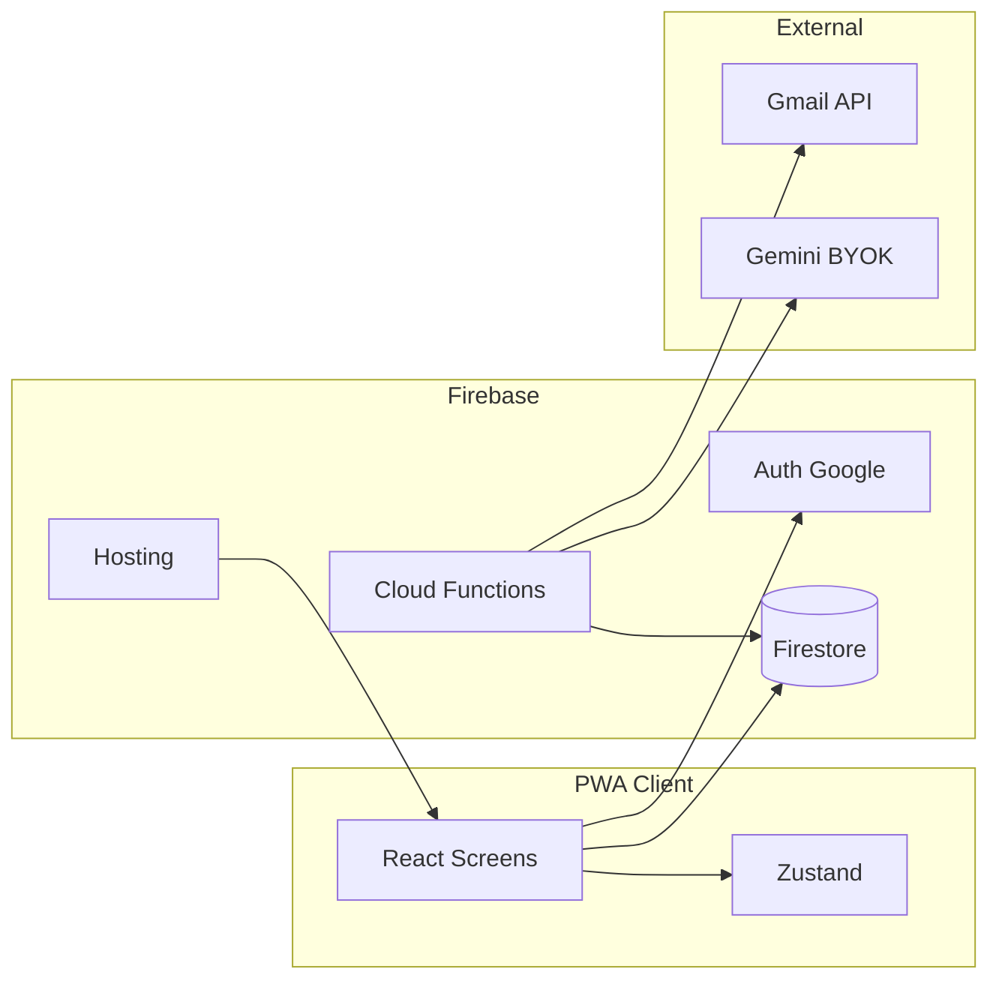

# Lumen — Product Architecture Map

**Updated:** 2026-06-30  
**Keep updated when:** new screens, Firebase collections, Cloud Functions, or integrations land.

---

## What the app does

1. User signs in with Google (Firebase Auth).  
2. User connects Gmail (OAuth; refresh token stored in Firestore — encryption TODO).  
3. Backend scans billing/receipt emails, parses subscriptions (Cloud Functions — deploy pending Blaze).  
4. App shows ledger: active/past/upcoming subs, PKR/USD amounts, renewal calendar, AI verdicts (Keep / Review / Cancel).  
5. User can act: cancel flow, command palette search, settings (theme, currency, Gemini BYOK key).

**Market:** Pakistan-first; PKR primary; Gmail as source of truth (no bank API).

---

## Major modules (production `src/`)

| Module | Path | Role |
|--------|------|------|
| Entry | `main.tsx`, `App.tsx` | Router, auth gate, theme, overlays mount |
| Screens | `screens/` | SignIn, Scanning, Dashboard, Ledger, Verdicts, Patterns, Alerts, Calendar, Mailroom, Settings |
| Layout | `components/layout/` | AppShell (mobile/desktop switch), BottomTabBar, DesktopShell, DesktopSidebar, DeskSubPanel |
| Overlays | `components/overlays/` | ConnectGmailFlow, CommandPalette, CancellationFlow, OnboardingTour |
| Sub detail | `components/subdetail/` | SubDetail, SubDetailOverlay, PriceHistorySparkline, SharedWith, VerdictHistory |
| Primitives | `components/primitives/` | Editorial UI atoms (Masthead, StatHero, VerdictTag, …) |
| Dashboard widgets | `components/dashboard/` | Trend, categories, price alerts, empty state |
| State | `store/` | Zustand: auth, subscriptions, UI (palette, connect, cancel, tour) |
| Hooks | `hooks/` | Firestore subs, Gmail accounts, theme, ⌘K, useMediaQuery |
| Lib | `lib/` | Firebase, format, seedData, gmailConnect, alerts, calendar, commandPaletteSearch |
| Types | `types/index.ts` | Subscription, Verdict, preferences |
| Styles | `styles/` | tokens.css, globals, typography |
| Backend | `functions/src/` | gmailInitialSync, parsers, Gemini fallback |
| PWA | `public/manifest.json`, `vite.config.ts` | vite-plugin-pwa, Workbox precache |

---

## User-facing surfaces

### Implemented (production)

| Surface | Route | Prototype ref |
|---------|-------|----------------|
| Sign In | `/signin` | `screens-mobile.jsx` |
| Scanning | `/scanning` | `screens-mobile.jsx` |
| Dashboard (Today) | `/` | `screens-mobile-main.jsx` |
| Ledger | `/ledger` | `screens-mobile-main.jsx` |
| Verdicts | `/verdicts` | `screens-mobile-aux.jsx` |
| Patterns (Shape) | `/patterns` | `screens-mobile-aux.jsx` |
| Settings (Office) | `/settings` | `screens-mobile-aux.jsx` |
| Connect Gmail overlay | global (authed) | `connect-gmail-flow.jsx` |

### Planned — mobile (`screens/`)

SubDetail, Alerts, Calendar, Mailroom (+ polish on existing tab screens).

### Planned — desktop (`desktop/`)

DeskHome, DeskLedger, DeskAlerts, DeskCalendar, DeskVerdicts, DeskShape, DeskMailroom, DeskOffice, DeskSubPanel (460px panel).

### Overlays (planned)

CommandPalette, CancellationFlow, OnboardingTour.

### Reference only

`public/prototype/` — full interactive mock (Babel inline); **do not ship this pattern**.

---

## Data & storage

### Firestore (`users/{uid}/…`)

| Collection / doc | Purpose |
|------------------|---------|
| User profile | email, displayName, plan |
| `gmail_accounts/{id}` | refresh token (encrypted — TODO), sync status |
| `subscriptions/{id}` | ledger rows — merchant, amounts, verdict, history |
| `receipts/{id}` | raw email parse audit trail |
| `preferences` | currency, theme, Gemini key (encrypted), tourDone |
| `cancellations/{subId}` | filed cancellations |

Region: **asia-south1**. Rules: owner uid only (`firestore.rules`).

### Local / seed

`src/lib/seedData.ts` — `SUBS_HEAVY`, `SUBS_LIGHT`, accounts, categories until Firestore populated.

### Client state (Zustand)

Ephemeral: active mailbox filter, open sub id, UI sheets, theme, currency, command palette open.

---

## Sync / API / background jobs

| Job | Trigger | Location | Status |
|-----|---------|----------|--------|
| `gmailInitialSync` | Callable after Gmail connect | `functions/src/gmailSync.ts` | Code ready; deploy blocked (Blaze) |
| `gmailIncrementalSync` | Scheduled every 6h | `functions/src/index.ts` | Stub only |
| Parser layer | Per message | `functions/src/parsers/index.ts` | 10 merchants in single registry file |
| Gemini fallback | Low confidence / no match | `functions/src/geminiParser.ts` | Implemented |

Gmail scope: `gmail.readonly`. Gemini: user BYOK from preferences.

Client: `src/lib/gmailConnect.ts` — OAuth popup, Firestore write, calls `gmailInitialSync`.

---

## Integrations

| Service | Status |
|---------|--------|
| Firebase Auth (Google) | Wired; keys via `.env` / `firebase-config.ts` |
| Firestore | Wired listener; rules in repo |
| Firebase Hosting | **Deployed** — `lumen-20260630.web.app` |
| Cloud Functions | Scaffolded in repo; **not deployed** (Spark → Blaze) |
| Gmail API | Client OAuth wired; server secrets pending |
| Gemini API | Parser fallback in functions; BYOK in Settings (UI partial) |
| FCM push | Phase 4 |

---

## AI / automation today

- **Prototype + seed:** static verdicts + evidence strings.  
- **Functions:** deterministic parsers + Gemini structured JSON extraction (undeployed).  
- **Runtime agent harness (product):** not implemented — see `docs/runtime-harness-opportunities.md`.  
- **Dev agent harness:** `docs/agentic-harness.md`, `AGENTS.md`, tool entry points.

---

## Local services

| Port | Service |
|------|---------|
| 5173 | Vite dev (PWA) |
| 4173 | Vite preview |
| 8765 | Static prototype server (may conflict — see harness) |

Registry: `/Users/yb/Dev/ai-rules/local-port-registry.md`

---

## Incomplete / experimental / legacy

| Item | Notes |
|------|--------|
| Phase 2 backend | Functions code in repo; Blaze + OAuth secrets needed to deploy |
| Sub Detail, Alerts, Calendar, Mailroom | Not ported |
| CommandPalette | `useKeyboard` + `uiStore.paletteOpen` stub only |
| `vite-plugin-pwa` | Dependency only; not in vite config |
| Desktop responsive shell | AppShell is mobile tabs only |
| `wrangler.jsonc`, `ecosystem.config.cjs` | Legacy Cloudflare path |
| Fixed “today” date in format helpers | Matches prototype demo date |
| Token storage | `refreshTokenEnc` naming; encryption not production-ready |

---

## Diagram (target architecture)

---

## For future agents

When adding a feature, update this doc’s **Implemented** tables and **Incomplete** list in the same commit as the feature (or handoff if no commit yet).
